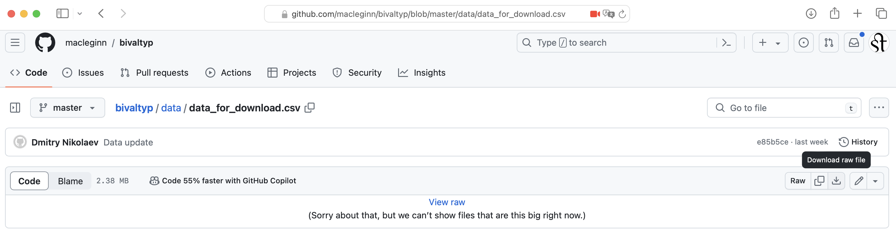
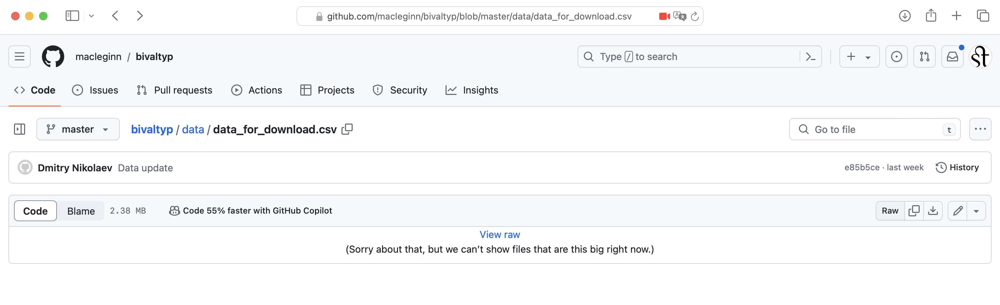

***

```{r, message=FALSE}
library(tidyverse)
library(readxl)
library(readr)
require(forcats)
library(cowplot)
library(knitr)
library(kableExtra)
```

# Introduction

From the [BivalTyp website](https://www.bivaltyp.info):

> BivalTyp is a typological database of bivalent verbs and their encoding frames. As of 2024, the database presents data for 129 languages, mainly spoken in Northern Eurasia. The database is based on a questionnaire containing 130 predicates given in context. Language-particular encoding frames are identified based on the devices (such as cases, adpositions, and verbal indices) involved in encoding two predefined arguments of each predicate (e.g. ‘Peter’ and ‘the dog’ in ‘Peter is afraid of the dog’). In each language, one class of verbs is identified as transitive. The goal of the project is to explore the ways in which bivalent verbs can be split between the transitive and different intransitive valency classes.

# Getting the data

The data from BivalTyp are available in a GitHub repository created and maintained by [
Dmitry Nikolayev](https://dnikolaev.com):

* https://github.com/macleginn/bivaltyp

First, let's figure out where the [raw data](https://en.wikipedia.org/wiki/Raw_data) are.

***

Here we find a number of [CSV tabular data](https://en.wikipedia.org/wiki/Comma-separated_values) files:

* https://github.com/macleginn/bivaltyp/tree/master/data

What are in these data files? Let's explore them.

***

OK, now how do we load the data into R/RStudio?

***

One way is to download them to your computer.



But then you need to make sure that they are:

1. Either in the same folder as the Rmd file you are working on (which means you've set the working directory to where you Rmd file is):

```{r, message=FALSE}
valency <- read_tsv('data_for_download.csv')
```

2. You load the file from the working directory to where the data file is, e.g.:

```{r, message=FALSE}
valency <- read_tsv('data/data_for_download.csv')
```

3. If the data are available online, e.g., in a GitHub repository (or elsewhere), you can load the data directly into R/RStudio with the ``url()`` function and a URL:

```{r, message=FALSE}
valency <- read_tsv(url('https://raw.githubusercontent.com/macleginn/bivaltyp/master/data/data_for_download.csv'))
```

But be careful -- it has to be the URL to the **raw data**, not the webpage! Click on the "Raw" button in GitHub to get the URL in the browswer window.


Another issue to remember -- although the file is labeled CSV for "comma separated values", the actual file is separated by tabs. Linguists often use TSV (i.e., tab separated values) for display purposes.

In R/RStudio you can specify the [delimiter](https://en.wikipedia.org/wiki/Delimiter), e.g., that it is tab instead of comma. Comma is the default standard, but in the wild you will come across many different characters as delimiters.

Finally, notice, the file we started with is called `data_for_download.csv`. This is which is not a very informative label for an R object. We pick a more telling name, e.g. `valency`.

***

# Explore the data

Every time you read in a data set, it's a good idea to have a look at it from a few angles to make sure that there are no major issues with both the import and the data themselves before you move on to doing some real statistics.

Let's start by looking at the variables with the function `str()` (it stands for "structure"):

```{r, message = FALSE}
str(valency)
```

Another way to get some sense of the data is to use the function `head()`:

```{r, message = FALSE}
head(valency)
```

Could you guess what the "sibling" function `tail()` does?

Interpret the output of `str()` and `head()`:

- How many variables are in the data set?

- Variables of which type are these?

- How many rows does it contain?

- Which variables are you likely to use for statistical analysis and which we probably won't need for it? 

(When a data set has many variables it might be more convenient to work with a smaller version of it containing just what you need.)

# `select` what you need

The data set `valency` contains a lot of textual data (examples and their translations), which won't be used for any statistical analysis. 

Let's use the `tidyverse` function `select` and select only the variables you might need for further analysis: you just list them one after another as arguments of the function  `select()`. 

Here we overwrite the object `valency`. (Do not panic, you always have access to the original data set in case you need it.)

```{r, message = FALSE}
valency <- valency  %>% select(language_no, predicate_no, X, Y, locus, valency_pattern)
```

It's a good idea to check with the familiar functions whether you got what you wanted. Notice an optional argument `n = 3` added to the function `head()`. What does it do? Verify your intuition by changing the value to e.g. `n = 5`.

```{r, message = FALSE}
head(valency, n = 3)
```

# `mutate()` character into factor

To get a first idea of how much of everything is in the data set, the function `summary()` is quite useful: 

```{r, message = FALSE}
summary(valency)
```

As it turns out, `summary()` on character data (our `X`, `Y`, `locus`, and `valency_pattern`) does not yield much of use. Why is this the case?

In R, there is an important distinction between the two data types for storing textual data (i.e. data with words): character and factor. 

We use **character** for textual data which do not represent categories/classes, e.g. example sentences and their glosses in the original large valency data set. Textual data which represent classes or categories should be stored as **factors** in R and not as character data type. 

For instance, in a patients data set, patient names would be stored as characters, as we don't really care how many `John`'s and `Rose`'s are there and whether they are more frequent than `Lee`'s and	`Monica`'s. On the other hand, `male` and `female` are categories from a list which includes these and other possibilities which we would like to be able to count for statistical analysis, for this reason we treat them as factors in R.

Different functions to import data into R have different default specifications: some generously treat all words as factors, others conservatively treat all words as characters. What does the function `read_tsv()` (or `read_csv()`) do? It assume that all words are character and then it is up to you to declare which ones should be factors. Let's declare that `X`, `Y`, `locus`, and `valency_pattern` are actually factors: 

Let's mutate to factor the variable `X`

```{r, message = FALSE}
valency <- valency %>% mutate(X = factor(X))
```

Compare the now factor `X` to the still character variable `Y`.

```{r, message = FALSE}
summary(valency)
```

Let's change (mutate) the other character variables into factor and have a look at their summary: 

```{r, message = FALSE}
valency <- valency %>% mutate(Y = factor(Y), locus = factor(locus), valency_pattern = factor(valency_pattern))
```

```{r, message = FALSE}
summary(valency)
```

It's getting more interesting, but at this stage you probably realize that we have no idea what languages and what predicates you are dealing with in this table. These details are part of two separate data sets and before we embark on any serious exploration, we need to join these data sets.

# Get `languages`

The only information on languages in our `valency` is some kind of ID under `language_no`, but what language number `1` represents? 

Let's get the data set with the detail on languages. We use the same function to read the data set and process it a bit following the same procedure as above:

```{r, message = FALSE, echo = FALSE}
languages <- read_tsv(url('https://raw.githubusercontent.com/macleginn/bivaltyp/master/data/languages.csv'))
```

What do we get?

```{r, message = FALSE}
head(languages)
```

There is definitely too much stuff here we are unlikely to use, let's `select()` only some variables:

```{r, message = FALSE}
languages <- languages %>% select(language_no, language, macroarea, glottocode, latitude, longitude)
```

# `join()` some tables

We want to join our two data frames `languages` and `valency`. They share one variable `language_no`, which we will use to perform the join.

There are various options for joining data frames. The choice matters when the data frames do not have overlapping set. This is not the case in our data set, so the various functions will yiled the same result. But in case you are curious:

- a `left_join()` keeps all observations in data frames x,

- a `right_join()` keeps all observations in data frames,

- a `full_join()` keeps all observations in x and y.

Let's take `left_join()` and check our enhanced data frame:

```{r, message = FALSE}
valency <- left_join(languages, valency, by = "language_no")
head(valency)
```

Now that we have some idea about the languages in our data set, we can explore them a bit further.

## Work with one language

Let's look at some valency details for a language or two. `filter()` allows you to access only those data which fulfill the specified conditions (e.g. `==` means it has to exactly matching `"English"`)
```{r, message = FALSE}
valency %>% filter(language == "English") %>% count(locus)
```

Is English any different form German?

```{r, message = FALSE}
valency %>% filter(language == "German") %>% count(locus)
```

It is! What about some other Germanic languages?

## Stack some Germanic languages
Here, a picture (a plot) might do a better job. Stacked barplots is one option.

```{r, message = FALSE}
valency %>% filter(language %in% c("English", "German", "Icelandic", "Dutch")) %>% 
      ggplot(aes(x = language, fill = locus)) + 
      geom_bar()
```

Interpret the plot

- Which language is the most diverse in terms of valency patterns (types)?

- Which language is most transitive (with respect to the 130 meanings in the sample)?

- Which language is the least transitive?

## Explore another set of languages

- Select another set of languages and compare the distributions of their valency patterns.

***
# Getting into `predicates`

##  What's in `predicates`?

The BiValTyp database has another file `predicates.csv` with useful details. Let's have a look at what's in it!

- First try on your own to read and explore the data set using the familiar functions.

- Which variable can we use to join this data set with `valency`?

- Which variables you are unlikely to use in the data exploration?

- Which variables should be converted to factor?

***
This is what we did: we first read the file and check what we get:

```{r, message = FALSE}
predicates <- read_tsv(url('https://raw.githubusercontent.com/macleginn/bivaltyp/master/data/predicates.csv'))
str(predicates)
```

We decided to keep only the variables `predicate_no`, `predicate_label_en`, and `argument_frame_en`.

```{r, message = FALSE}
predicates <- predicates  %>% select(predicate_no, predicate_label_en, argument_frame_en)
```

We convert `predicate_label_en` and `argument_frame_en` into factors:

```{r, message = FALSE}
predicates <- predicates %>% mutate(predicate_label_en = factor(predicate_label_en), argument_frame_en = factor(argument_frame_en))
```

And see what we get:^[There are fewer types of `argument_frame_en` (126) than types in `predicate_label_en` (130). There is an explanation to this.]


```{r, message = FALSE}
str(predicates)
```


## `join()` `valency` and `predicates` data sets
