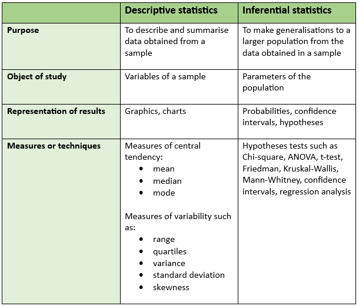
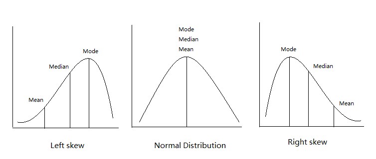

Data modeling
================
Steven Moran and Alena Witzlack-Makarevich
(25 July, 2024)

- [Introduction](#introduction)
- [Descriptive statistics](#descriptive-statistics)
- [Inferential statistics](#inferential-statistics)
- [Which statistical test do I use?](#which-statistical-test-do-i-use)
  - [What are my data types?](#what-are-my-data-types)
  - [What do I want to investigate /
    test?](#what-do-i-want-to-investigate--test)
  - [How do I find my statistical
    test?](#how-do-i-find-my-statistical-test)
- [Parametric versus nonparametric
  statistics](#parametric-versus-nonparametric-statistics)
- [Statistical assumptions](#statistical-assumptions)
- [Case studies](#case-studies)
  - [Comparison test](#comparison-test)
  - [Cause and effect tests:](#cause-and-effect-tests)
  - [Correlation test](#correlation-test)

``` r
library(tidyverse)
library(knitr)
```

# Introduction

Scientists are interested in **discovering/understanding** something
about real world phenomena. Three types of goals:

1.  Describe
2.  Explain
3.  Predict

One goal of **data modeling** is to provide a summary of a data set,
i.e., describe it. Another is to come up with **hypotheses for
descriptive and inference purposes**.

- **Descriptive statistics**: organize, summarize, and communicate a
  group of numerical observations, e.g, with visualizations.

- **Inferential statistics**: use sample data to make draw conclusions
  about the larger population, i.e., fit statistical models to test
  hypothesis to infer things about the data.

<figure>

<figcaption aria-hidden="true"><a
href="https://s4be.cochrane.org/blog/2024/01/09/descriptive-vs-inferential-statistics-an-overview/"
class="uri">https://s4be.cochrane.org/blog/2024/01/09/descriptive-vs-inferential-statistics-an-overview/</a></figcaption>
</figure>

# Descriptive statistics

**Descriptive statistics** use [summary
statistics](https://en.wikipedia.org/wiki/Summary_statistics) to
**summarize a set of observations**, including for example:

- [Central tendency](https://en.wikipedia.org/wiki/Central_tendency)
- [Dispersion](https://en.wikipedia.org/wiki/Statistical_dispersion)
- [Shape of the
  distribution](https://en.wikipedia.org/wiki/List_of_probability_distributions)
- [Statistical dependence](https://en.wikipedia.org/wiki/Correlation)

The measure of [central
tendency](https://en.wikipedia.org/wiki/Central_tendency) is one way to
make many data points comprehensible to humans by compressing them into
one value. Central tendency is a descriptive statistic that best
represents the center of a data set i.e. a particular value that all the
data seem to be gathering around it’s the “typical” score.

The most commonly reported measure of central tendency is the **mean**,
the arithmetic average of a group of scores.

The **median** is the middle score of all the scores in a sample when
the scores are arranged in ascending order.

Simply creating a visual representation of the distribution often
reveals its central tendency.

Let’s look at some data about athletes.

``` r
athletes <- read_csv('data/athletes.csv')
```

We can quickly visualize the distribution of our variables.

``` r
hist(athletes$height)
```

<!-- -->

``` r
hist(athletes$weight)
```

<!-- -->

``` r
hist(athletes$age)
```

<!-- -->

In a histogram or a polygon of a normal distribution the central
tendency is usually near the highest point.

------------------------------------------------------------------------

The specific way that data cluster around a distribution’s central
tendency can be measured three different ways:

- [Mean](https://en.wikipedia.org/wiki/Mean)
- [Median](https://en.wikipedia.org/wiki/Median)
- [Mode](https://en.wikipedia.org/wiki/Mode_(statistics))

Or visually:

<figure>

<figcaption aria-hidden="true">Mean, median, mode.</figcaption>
</figure>

# Inferential statistics

Here is the big picture.

<figure>

<figcaption aria-hidden="true">The big picture.</figcaption>
</figure>

Here’s also a useful tutorial:

- <http://varianceexplained.org/RData/>

------------------------------------------------------------------------

When properties of the population are inferred from a sample, we are
undertaking **statistical inference**.

- A **population** consists of all the scores of some specified group of
  interest (in texts one uses N to refer to it)

- A **sample** is a subset of a population (n)

------------------------------------------------------------------------

**Why do we need samples?**

------------------------------------------------------------------------

Samples are used most often because we are rarely able to study every
object in a population (e.g. every person in the world or in a country,
every language, every sentence ever produced).

------------------------------------------------------------------------

**Historical detour: How did classical statistics come about?**

In the late 19th and early 20th centuries by a small group of people,
mostly in Great Britain, working for example at
[Guinness](https://en.wikipedia.org/wiki/Guinness) and in agriculture.
They had:

- No computational capabilities
- No graphing capabilities
- Very small and very expensive data sets

Their situation was basically the **opposite of what we have today**.

Given their limitations, it took a great deal of ingenuity to solve
problems that we – for the most part – no longer have, e.g.:

- We have lots of computing power
- We have lots of graphing capabilities
- There’s lots of data out there

Instead, today’s modern statistics is largely focused on areas like
**Bayesian reasoning, non-parametric tests, resampling, and
simulations**.

# Which statistical test do I use?

## What are my data types?

In contrast to variables in computer programming, variables in
statistics are **properties** or **characteristics** used to measure a
population of individuals. A variable is thus a quantity whose value can
change across a population.

They include:

- **Qualitative variables** – measure non-numeric qualities and are not
  subject to the laws of arithmetic.

- **Quantitative variables** – measure numeric quantities and arithmetic
  can be applied to them.

Qualitative variables are also call **categorical** or **discrete**
variables. Quantitative variables can be measured, so that their rank or
score can tell you about the degree or amount of variable.

A hierarchy of variable types in statistics is given in the image below
taken from this [Stats and R](https://statsandr.com/terms/) blog.

<figure>

<figcaption aria-hidden="true">Variable types.</figcaption>
</figure>

As you can see, variables in statistics can be classified into four
types under qualitative and quantitative variables:

- **Nominal** – a qualitative variable where no ordering is possible
  (e.g., eye color) as implied by its **levels** – levels can be for
  example binary (e.g., do you smoke?) or multilevel (e.g., what is your
  degree – where each degree is a level).

- **Ordinal** – a qualitative variable in which an order is implied in
  the levels, e.g., if the side effects of a drug taken are measured as
  “light”, “moderate”, “severe”, then this qualitative ordinal value has
  a clear order or ranking (but note we don’t know *how* different these
  levels are from one to the next!).

- **Discrete** – variables that can only take specific values (e.g.,
  whole numbers) – no values can exist between these numbers.

- **Continuous** – variables can take the full range of values (e.g.,
  floating point numbers) – there are an infinite number of potential
  values between values.

------------------------------------------------------------------------

Consider these examples:

- What number were you wearing in the race? – “5”!
- What place did you finish in? – “5”!
- How many minutes did it take you to finish? – “5”!

The three “5”s all look the same.

However, the three variables (identification number, finish place, and
time) are quite different. Because of the differences, each “5” has a
different possible interpretation.

------------------------------------------------------------------------

## What do I want to investigate / test?

- **Comparison tests**: test for differences among group means (e.g.,
  what is the difference in F1 of vowels between women and men?)

- **Correlation tests**: test whether variables are related without
  hypothesizing a cause-and-effect relationship (e.g., how are
  population size and phoneme inventory size related?)

- **Regression tests**: test for cause-and-effect relationships (e.g.,
  does income predict happiness? do intoxicated speakers increase their
  articulation errors?)

## How do I find my statistical test?

As with the determining which [plot to
use](https://github.com/bambooforest/IntroDataScience/tree/main/6_data_visualization#which-plots-to-use),
use a cheat sheet to determine which statistical test to use!

- <https://dacg.in/2018/11/17/statistical-test-cheat-sheet/>

- <https://www.scribbr.com/statistics/statistical-tests/>

There are many other resources out there. Search for them!

# Parametric versus nonparametric statistics

**Parametric analyses** are tests for which we have prior knowledge of
the population distribution, e.g., we know the distribution is normal.
They also include tests in which we can approximate a normal
distribution with the [central limit
therom](https://en.wikipedia.org/wiki/Central_limit_theorem).

**Non-parametric analyses** are tests that do not make any assumptions
about the parameters of the population under study, i.e., there is no
known distribution. This is why they are also called distribution-free
tests.

<figure>

<figcaption aria-hidden="true">Hypothesis testing.</figcaption>
</figure>

**Ask**: what are the assumptions of the statistical test?

# Statistical assumptions

Statistical tests make assumptions about the data being tested. If the
assumptions for a given statistical test are violated, then the test is
not valid and the results may also not be valid.

1.  **Independence of observations**: the observations/variables you
    include in your test should not be related(e.g. several tests from a
    same test subject are not independent, while several tests from
    multiple different test subjects are independent)

2.  **Homogeneity of variance**: the “variance””” within each group is
    being compared should be similar to the rest of the group variance.
    If a group has a bigger variance than the other(s) this will limit
    the test’s effectiveness.

3.  **Normality of data**: the data follows a normal distribution,
    normality means that the distribution of the test is normally
    distributed (or bell-shaped) with mean 0, with 1 standard deviation
    and a symmetric bell-shaped curve.

See the case study on income vs. happiness for a detailed example of
checking statistical assumption in a linear regression model:

# Case studies

The basic process is:

- Set up a hypothesis, and assume that it is true.

- Gather data from some real-world experiment that is relevant to the
  hypothesis.

- Make a determination about the hypothesis, based on the idea of “how
  likely is our data given the hypothesis?”

The logic of [hypothesis
testing](https://github.com/bambooforest/APY313/tree/main/7_data_modeling#hypothesis-testing)
is as follows. After we have identified the H0 and H1, we can do only
one of two things:

1.  Reject the H0 in favor of the H1

2.  Fail to reject H0 and thus keep it

Null hypothesis testing corresponds to a *reductio ad absurdum* argument
in logic, i.e., a claim is assumed valid if its counter claim is
improbable.

The procedure for deciding is roughly as follows:

1.  Take a random sample from the population

2.  Assume that H0 holds

3.  If the sample data are consistent with the H0, keep H0

4.  If the sample data are inconsistent with the H0, reject the H0 in
    favor of the H1.

## Comparison test

- [Are women’s F1 higher than
  men’s?](https://github.com/bambooforest/APY313/tree/main/case_studies/F1)

## Cause and effect tests:

- [Linear regression example: income
  vs. happiness](https://github.com/bambooforest/APY313/tree/main/case_studies/linear_regression)
- [Linear regression example: Does weight increase with
  height?](https://github.com/bambooforest/APY313/tree/main/case_studies/athletes)
- [Logistic regression example: Do intoxicated speakers increase their
  articulation
  errors?](https://github.com/bambooforest/APY313/tree/main/case_studies/logistic_regression)
- [ANOVA example: What is the diffence in average weight of Olympic
  atheletes in different sporting
  events?](https://github.com/bambooforest/APY313/tree/main/case_studies/ANOVA)
- [Multiple linear regression example: What is the effect of biking and
  smoking on heart
  disease?](https://github.com/bambooforest/APY313/tree/main/case_studies/multiple_linear_regression)

## Correlation test

- [Does population size correlate with phoneme inventory
  size?](https://www.jstor.org/stable/pdf/23357556.pdf)
