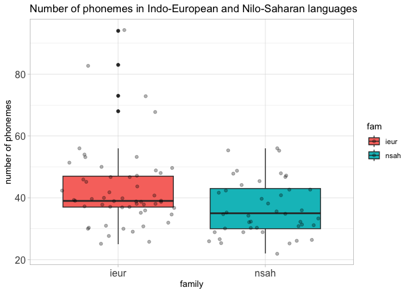
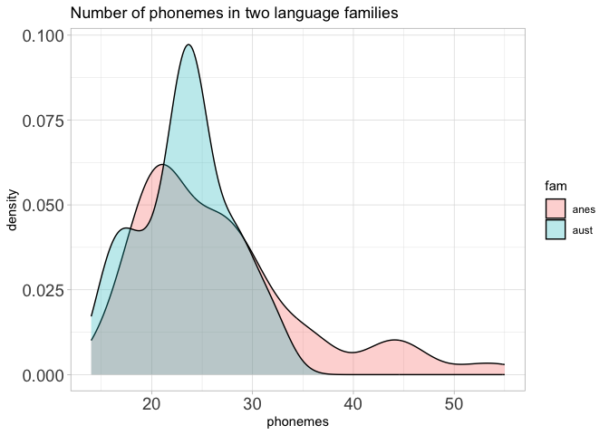
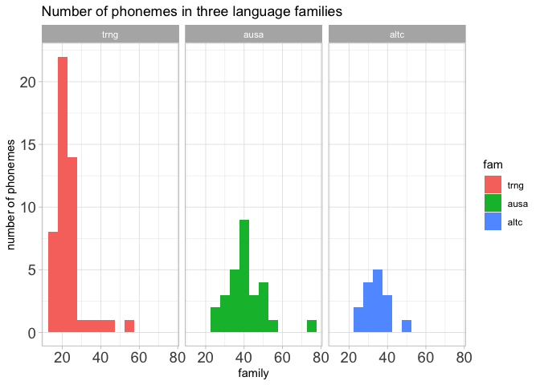
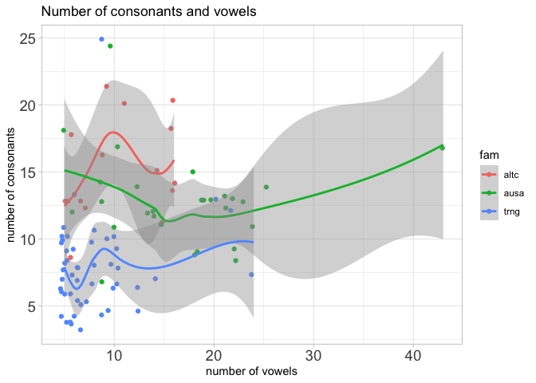

Recreate PHOIBLE visualizations
================
Alena Witzlack-Makarevich and Steven Moran
(23 July, 2024)

# Introduction

Here are a series of taks to recreate visualizations of phoible data
(see [phoible.csv](data/phoible.csv)).

# Task 1: Compare Indo-European (ieur) vs. Nilo-Saharan (nsah)

Recreate the boxplot below that compares the number of phonemes in
Nilo-Saharan (`nsah`) languages and in Indo-European languages (`ieur`).

You need to filter for these two families first.

# Task 2: Add some jitter to Indo-European (ieur) vs. Nilo-Saharan (nsah)

Add a scatter plot atop of the boxplots to give some idea about the
number of languages in each group.

# Task 3: boxplot vs. density plot

Visualize the distribution of the number of phonemes in two language
families with density plots.

# Task 4: histogram in facets

Visualize the distribution of phonemes in the three families with
faceted histograms. Order them by the number of languages in each group
from large to small.

# Task 5: Scatterplot without much overlapping

Visualize the correlation of number of consonants and number of vowels.

<!-- 

-->
