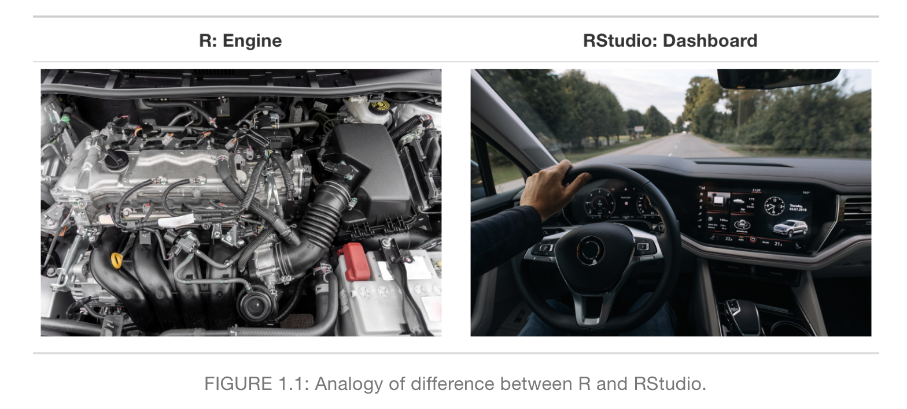
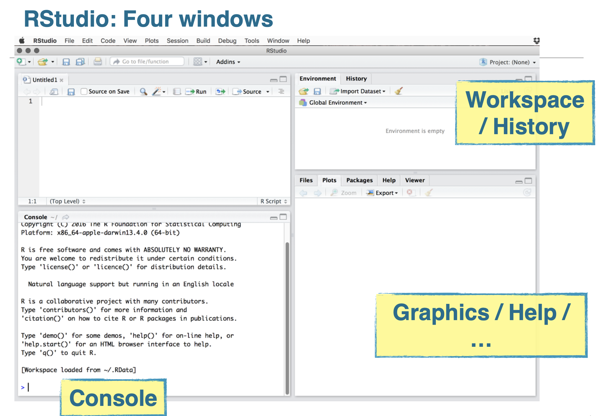
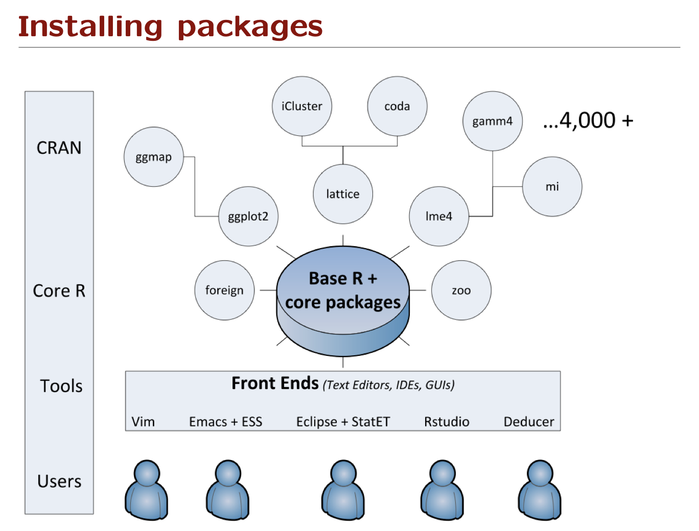

***

# Overview

Here we provide course materials for the Salos 2024 summer school, "Linguistic data from fieldwork to R":

* https://www.academiasalensis.org/en/conference-and-summer-school/2024-summer-school/

The curriculum has three parts:

1. Linguistic Fieldwork. Lecturer: dr. Maria Khachaturyan, University of Helsinki
2. Data annotation. Lecturer: dr. Alena Witzlack-Makarevich, the Hebrew University of Jerusalem
3. Quantitative methods. Lecturer: dr. Steven Moran, Université de Neuchâtel

This repository provides materials for (3).


# Getting started

To get started with (3), please refer to:

* [Getting started](Getting_started.md)

and install the software (R, RStudio, spreadsheet application) on your personal computer.

We have shared with you some courses on [DataCamp](https://www.datacamp.com) to get you up to speed with the basics of using spreadsheets (tabular data), visualizations, and R/RStudio.


# R vs RStudio

R is the programming language and RStudio is an "integrated development environment". In other words, it's an add-on to R, which provides a "user friendly" graphical interface to R. 

* https://moderndive.com/1-getting-started.html



The basic layout of RStudio.



Once you have the software R and the RStudio graphical user interface ([GUI](https://en.wikipedia.org/wiki/Graphical_user_interface)) installed, you can begin to explore the functionalities of R!


# R vs R packages (aka libraries)

So-called "Base R" contains the "core packages" or the R programming. These include for example:

* Using R as a calculator
* Using basic core fuctions like `read.csv()`, `summary()`, `table()`, `head()`

There are many more functions available from "CRAN" -- the [Comprehensive R Archive Network](https://cran.r-project.org).

Here is a [visualization](http://faculty.washington.edu/kenrice/rintro/sess08.pdf) of core R vs R packages:



Why do the packages not in Core R need to be installed (once) individually and separately?

**Because there are over **23,000** packages in R.**

You don't want all that on your computer!!!

*** 

Any introduction to R should explain how to install and load R libraries. 

* https://rmarkdown.rstudio.com/lesson-1.html
* https://www.datacamp.com/tutorial/r-packages-guide

The basics are:

1. Use the function ``install.packages('your-packages-name')`` to install the R library (aka package) **once**

2. Each type you create a report (or script) that has code from that R package/library, you have to load it like this: ``library(your-package-name)``

>>> Yes, it is confusing of when you need to use quotes (' ') and when you don't need to. As with any programming language, or "syntax", there are simply some things that are idiosyncratic (imagine the engineers or developers arguing about one way or another to do something). 

For any programming language idiosyncrasies, the user simply has to either:

1. Remember them.

2. Look them up (e.g., try googling it).

***

Now for an example. If we want to install a package / library, we can use something like this (without the "#" -- this is a special character to tell R that this line of code is commented out, i.e., it should not be run):

```{r}
#install.packages('tidyverse')
#install.packages('knitr')
```

Here we note we have prepended the line of code with "#", which tells R: do not run this code! Why? Because we don't want to run this line of code every time we run this file. Install packages once! You can do this by uncommented the code above (remove the "#") and run the code chunk.

Once installed, you can always load the library (aka package) from any script, within RStudio, etc.

```{r, message=FALSE}
library(tidyverse)
library(knitr)
```


# RMarkdown

We will be using RMarkdown, which is an authoring framework for data science. 

It combines R code with R [Markdown](https://en.wikipedia.org/wiki/Markdown), a "language" for creating [formatted text](https://en.wikipedia.org/wiki/Formatted_text), into **the same document**. 

Here is an [example](https://r4ds.had.co.nz/r-markdown.html):


<!--
A [markup language](https://en.wikipedia.org/wiki/Markup_language) species how a document should be formatted and structured. This is different than "What You See Is What You Get" ([WYSIWYG](https://en.wikipedia.org/wiki/WYSIWYG)) software -- such as Microsoft Word -- that allows the text and structure to be formatted as it should appear.
-->

Why do we take this approach? Because we want to produce **reproducible** research. And one way of doing that is to have the document **and** the code in the same scientific report.

In RMarkdown, the file extension is [.Rmd](https://fileinfo.com/extension/rmd). Together with the `knitr` package (aka library) and RStudio, this report that you're reading "[compiles](https://en.wikipedia.org/wiki/Compilation)" this R Markdown file (.Rmd) file into a [Markdown file](https://fileinfo.com/extension/md) (.md) file that [displays nicely in GitHub](README.md).

You can also compile as PDF. Or as HTML. Or as lots of other files types! And you can do so easily, by changing the header at the top of this file.


# Getting up to speed

Getting up to speed (including the DataCamp exercises) involves understanding:

- Table data
- How to load, access, and manipulate data
- Data types (in programming / R vs statistics)

Data types are important because they help you decide which data visualizations and statistical tests you can use (cheat sheets below).

To get up to speed, please refer to:

* [Getting up to speed](Getting_up_to_speed.md)


# Cheat sheets

## RMarkdown

Here are some RMarkdown cheat sheets:

- <https://www.rstudio.com/wp-content/uploads/2015/02/rmarkdown-cheatsheet.pdf>

- <https://ethz.ch/content/dam/ethz/special-interest/math/statistics/sfs/Education/Advanced%20Studies%20in%20Applied%20Statistics/course-material-1719/Datenanalyse/rmarkdown-2.pdf>

And here is some more advanced explanation on writing scientific reports in RMarkdown:

- https://github.com/bambooforest/APY313/tree/main/2_writing_scientific_reports


## Data visualizations

Here is a cheat sheet for choosing the right visualization:

* https://www.data-to-viz.com
* https://datavizcatalogue.com/search.html
* https://datavizproject.com

And some more advanced explanation on which types of plots to use:

- https://github.com/bambooforest/IntroDataScience/tree/main/6_data_visualization#which-plots-to-use


## Choosing the right statistic

Here are some cheat sheets on how to choose the right statistical test:

* https://towardsdatascience.com/statistical-testing-understanding-how-to-select-the-best-test-for-your-data-52141c305168

* https://www.scribbr.com/statistics/statistical-tests/

* https://dacg.in/2018/11/17/statistical-test-cheat-sheet/

And some more advanced explanation on the process:

* https://github.com/bambooforest/APY313/tree/main/7_data_modeling
