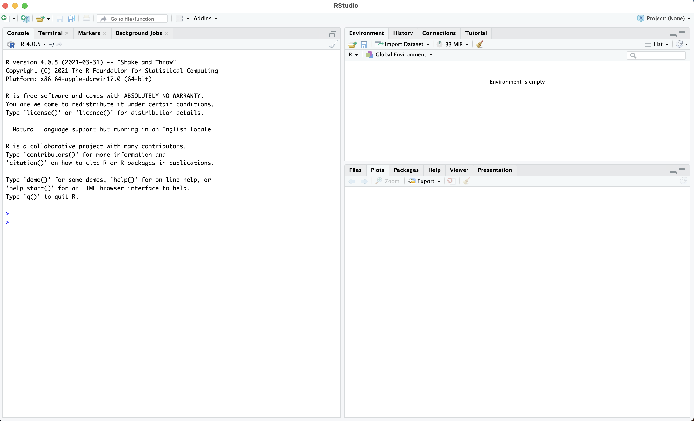
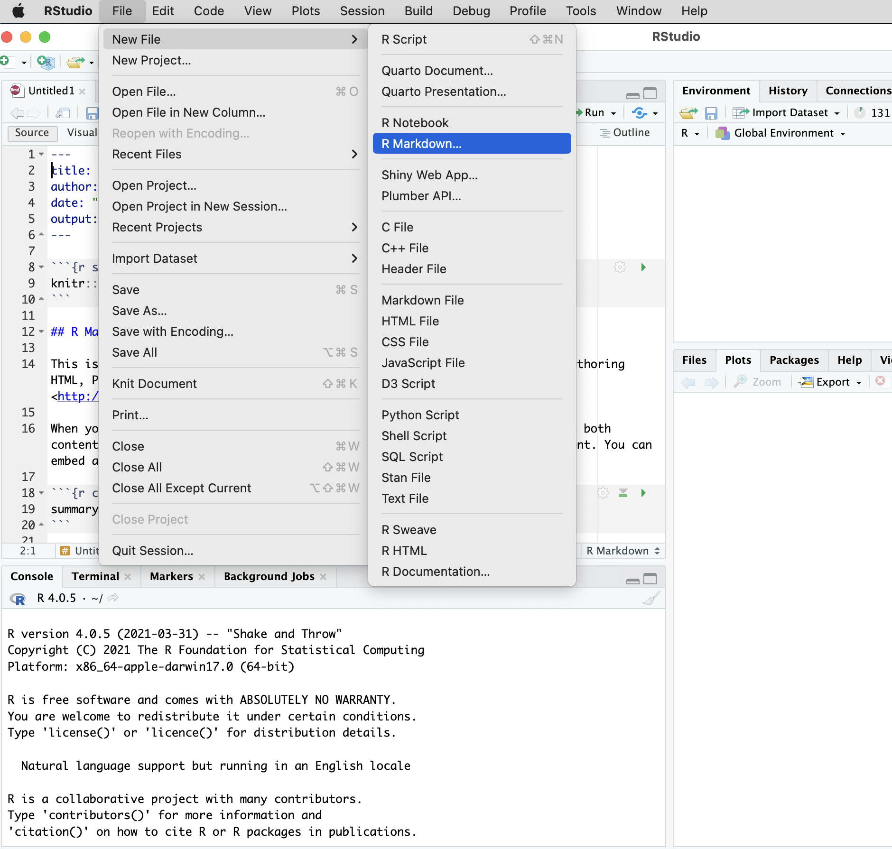
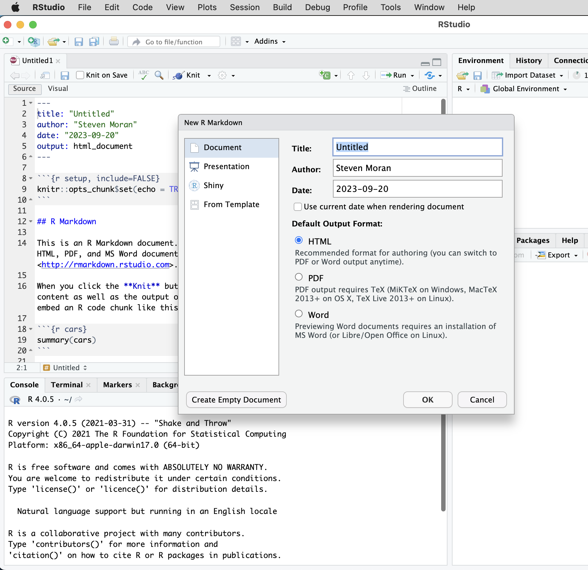
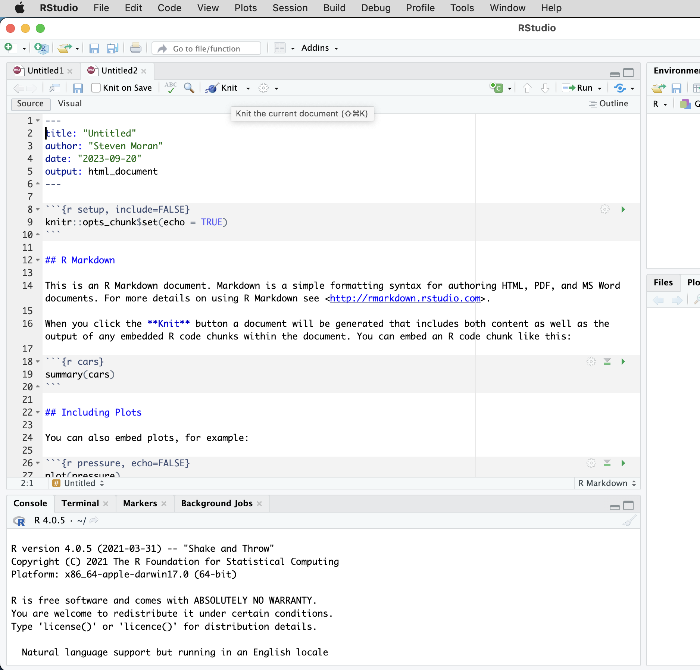
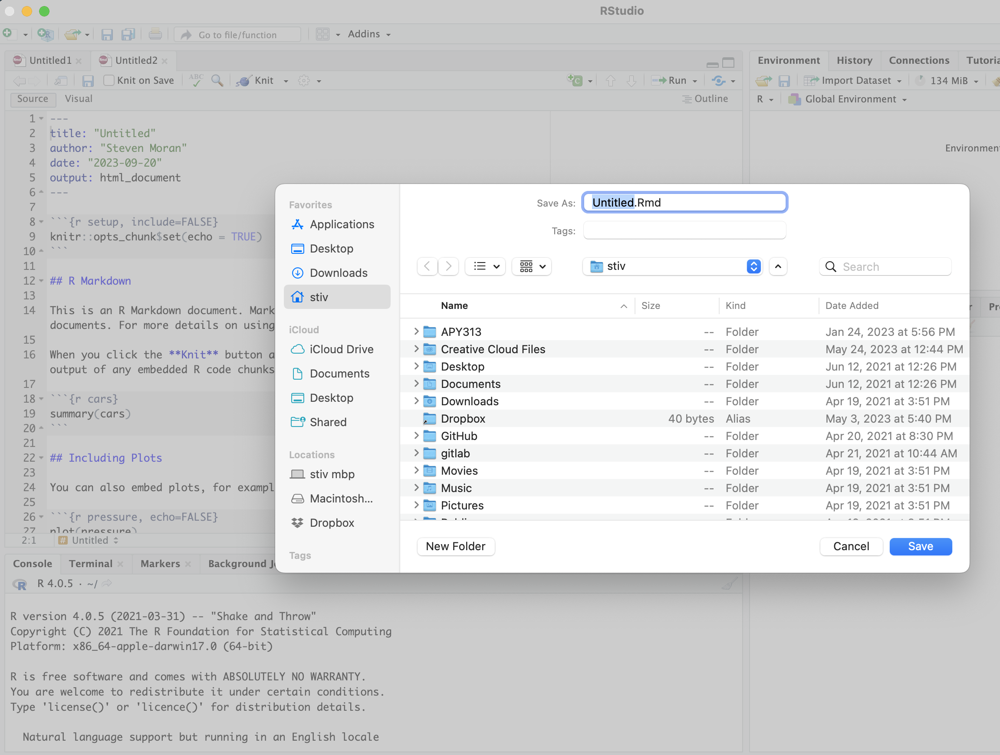
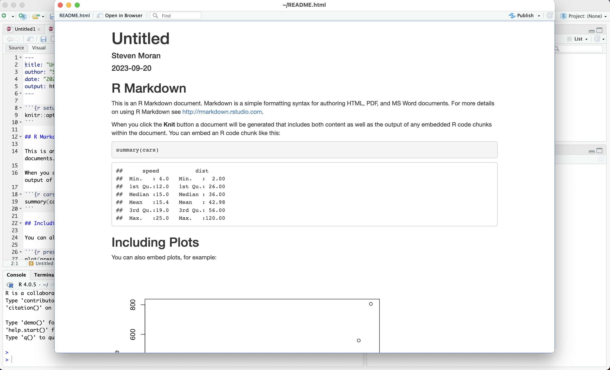

Salos 2024 summer school: Linguistic data from fieldwork to R
================
Steven Moran
(16 June, 2024)

- [Getting started](#getting-started)
- [R](#r)
- [RStudio](#rstudio)
- [What is the difference between R and
  RStudio?](#what-is-the-difference-between-r-and-rstudio)
- [Make sure that RStudio works](#make-sure-that-rstudio-works)
- [Spreadsheets](#spreadsheets)
- [Text editor (optional, but
  suggested)](#text-editor-optional-but-suggested)

------------------------------------------------------------------------

# Getting started

To get started with this course, you will need to
[install](https://en.wikipedia.org/wiki/Installation_(computer_programs))
several software packages and get to know how to use them. Follow all
the steps that you need below.

For detailed instruction, see also:

- <https://moderndive.com/1-getting-started.html>

# R

This course assumes you are familiar with the basics of the [R
programming
language](https://en.wikipedia.org/wiki/R_(programming_language)). If
you are not, please familiarize yourself with the basics. There are many
tutorials out there! Here is a free one from
[DataCamp](https://www.datacamp.com):

- <https://app.datacamp.com/learn/courses/free-introduction-to-r>

Here’s some history about R and a description of what it is used for and
by whom:

- <https://www.datacamp.com/blog/all-about-r>

# RStudio

Install [RStudio](https://www.rstudio.com), unless you are already an R
pro and prefer some other
[GUI](https://en.wikipedia.org/wiki/Graphical_user_interface),
[CLI](https://en.wikipedia.org/wiki/Command-line_interface), or
[computer program](https://en.wikipedia.org/wiki/Computer_program) that
allows you to [create R
markdown](https://rmarkdown.rstudio.com/authoring_quick_tour.html)
reports that will be stored in your GitHub repository. Note: be weary of
automatic spell checking – and presumably grammar checking – in RStudio.

There are a lot of tutorials out there about RStudio. Here are two
useful ones:

- <https://www.youtube.com/watch?v=FIrsOBy5k58>
- <https://www.datacamp.com/tutorial/r-studio-tutorial>

# What is the difference between R and RStudio?

Here is a good description of the difference between R and RStudio:

- <https://moderndive.com/1-getting-started.html>

See in particular Figure 1.1: Analogy of difference between R and
RStudio.

# Make sure that RStudio works

You should see something like this when you open **RStudio**. (You will
not need to open **R** directly.)

<figure>

<figcaption aria-hidden="true">Open RStudio.</figcaption>
</figure>

Then create an RMarkdown file.

<figure>

<figcaption aria-hidden="true">Create RMarkdown file.</figcaption>
</figure>

Give it a title or leave it “Untitled”. Hit OK.

<figure>

<figcaption aria-hidden="true">Give it a title.</figcaption>
</figure>

Now you should have a basic RMarkdown file, like this:

<figure>

<figcaption aria-hidden="true">Example RMarkdown file.</figcaption>
</figure>

Click on the **Knit** button and it will prompt you to save the file.
Save it somewhere on your computer.

<figure>

<figcaption aria-hidden="true">Click on Knit and save the
file.</figcaption>
</figure>

Then RStudio should “knit” (aka
“[compile](https://en.wikipedia.org/wiki/Compiler)”) your RMarkdown file
and display it for you.

<figure>

<figcaption aria-hidden="true">Your report should appear.</figcaption>
</figure>

# Spreadsheets

You will also want a [spreadsheet
program](https://en.wikipedia.org/wiki/Spreadsheet), so that you can
look at and manipulate data in [tabular
formats](https://en.wikipedia.org/wiki/Table_(information)). Here are
some options:

- [Microsoft Excel](https://en.wikipedia.org/wiki/Microsoft_Excel)
- [OpenOffice](https://en.wikipedia.org/wiki/Apache_OpenOffice)
- [Numbers](https://en.wikipedia.org/wiki/Numbers_(spreadsheet))

Here is an excellent introduction to Excel (“You Suck at Excel with Joel
Spolsky”):

- <https://www.youtube.com/watch?v=0nbkaYsR94c>

# Text editor (optional, but suggested)

You may need a good [text
editor](https://en.wikipedia.org/wiki/Text_editor) to access and edit
[plain text](https://en.wikipedia.org/wiki/Plain_text). Please try to
understand the difference between plain text and so-called [rich
text](https://en.wikipedia.org/wiki/Formatted_text). For example, a good
text editor is not [Microsoft
Word](https://en.wikipedia.org/wiki/Microsoft_Word) – MS Word is a good
rich text editor. Depending on your computer’s [operating
system](https://en.wikipedia.org/wiki/Operating_system), you might
consider for example:

- [BBEdit](https://en.wikipedia.org/wiki/BBEdit):
  <https://www.barebones.com/products/bbedit/>
  ([macOS](https://en.wikipedia.org/wiki/MacOS))
- [Notepad++](https://en.wikipedia.org/wiki/Notepad%2B%2B):
  <https://notepad-plus-plus.org> ([Microsoft
  Windows](https://en.wikipedia.org/wiki/Microsoft_Windows))

If you are using some form of
[Linux](https://en.wikipedia.org/wiki/Linux) you probably already know
what you’re doing.

Note: there are many other plain text editor software programs out
there. [LMGTFY](https://www.dictionary.com/e/slang/lmgtfy/):

- <https://www.google.com/search?&q=best+plain+text+editors>
