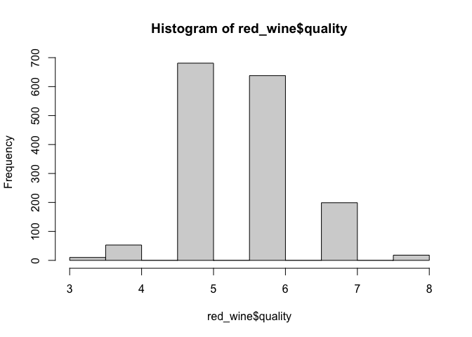
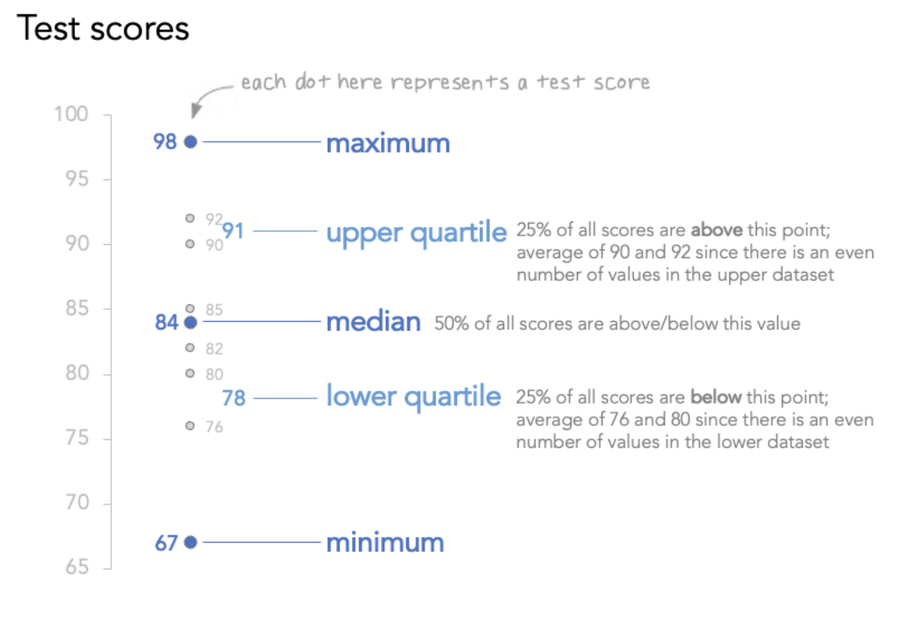
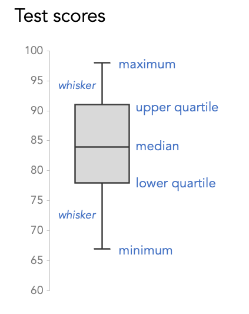
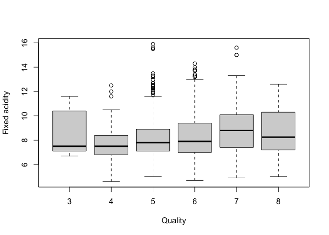
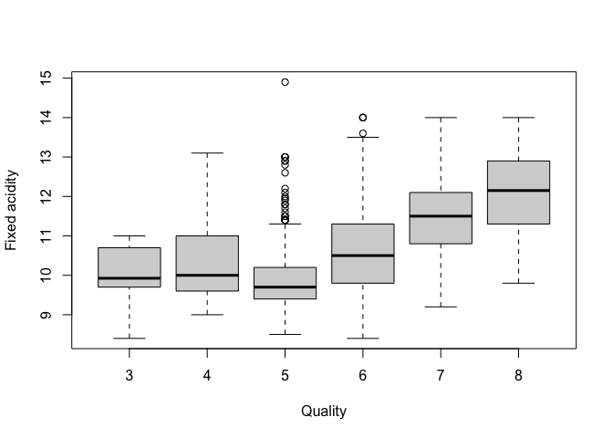
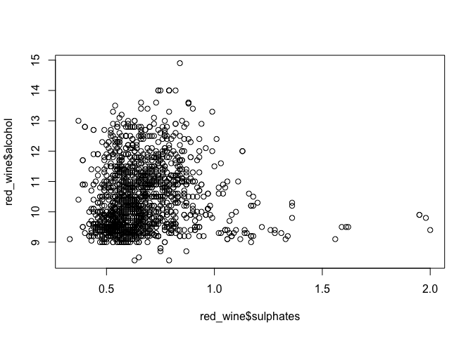
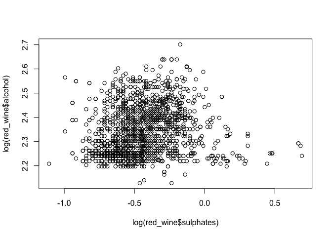

Visualization basics
================
Steven Moran and Alena Witzlack-Makarevich
(25 July, 2024)

- [Case study: Come fly with me](#case-study-come-fly-with-me)
- [Wide vs long table formats](#wide-vs-long-table-formats)
- [Visualization workflow](#visualization-workflow)
- [What do I visualize?](#what-do-i-visualize)
- [Plotting in base R (beginner)](#plotting-in-base-r-beginner)
  - [Case study: Red wine quality](#case-study-red-wine-quality)
- [Layered graphics in ggplot2 in R
  (advanced)](#layered-graphics-in-ggplot2-in-r-advanced)
  - [For advanced students](#for-advanced-students)

``` r
library(tidyverse) # all the libraries you need for data wrangling and plotting
library(knitr) # makes nice looking tables with the "kable()" function
```

# Case study: Come fly with me

Which airlines should you travel with – and which should you avoid? We
sift through the data so you don’t have to (by James Tozer. April/May
2016):

- <https://www.1843magazine.com/travel/what-the-numbers-say/come-fly-with-me>

> > > For prices, we took the world’s 30 busiest airports in the last
> > > quarter of 2015, and analyzed direct flights between them on
> > > week-long return trips from a sample at the start of August 2016.

> > > We used flight-volume data from FlightStats.com and
> > > customer-satisfaction data from Skytrax, an airline consultancy
> > > which asks users to mark carriers out of five for the quality of
> > > their food, service, comfort, in-flight entertainment and value
> > > for money.

------------------------------------------------------------------------

Some questions:

- Which airlines are the best or the worst? Why?
- Which airlines would you travel with – and which should you avoid?

------------------------------------------------------------------------

<figure>

<figcaption aria-hidden="true">International airlines price vs
service</figcaption>
</figure>

------------------------------------------------------------------------

# Wide vs long table formats

There are two basic presentations of tabular data:

- **Wide**: good for collecting data
- **Long** (aka narrow): good for data visualization in R

We often want to “reshape” data from wide to long (less often long to
wide).

The `gather` function in the `tidyverse` library lets you convert wide
data into tidy data. Let’s consider an example from [this great
course](https://datasciencelabs.github.io).

The annual fertility rates data from `dslabs` and `gapminder` for
Germany and South Korea in wide format:

``` r
fertility_wide <- read_csv(url('https://raw.githubusercontent.com/rafalab/dslabs/master/inst/extdata/life-expectancy-and-fertility-two-countries-example.csv'))
```

``` r
fertility_wide %>% kable() # cool trick to make the table show up nicely!
```

| country | 1960_fertility | 1960_life_expectancy | 1961_fertility | 1961_life_expectancy | 1962_fertility | 1962_life_expectancy | 1963_fertility | 1963_life_expectancy | 1964_fertility | 1964_life_expectancy | 1965_fertility | 1965_life_expectancy | 1966_fertility | 1966_life_expectancy | 1967_fertility | 1967_life_expectancy | 1968_fertility | 1968_life_expectancy | 1969_fertility | 1969_life_expectancy | 1970_fertility | 1970_life_expectancy | 1971_fertility | 1971_life_expectancy | 1972_fertility | 1972_life_expectancy | 1973_fertility | 1973_life_expectancy | 1974_fertility | 1974_life_expectancy | 1975_fertility | 1975_life_expectancy | 1976_fertility | 1976_life_expectancy | 1977_fertility | 1977_life_expectancy | 1978_fertility | 1978_life_expectancy | 1979_fertility | 1979_life_expectancy | 1980_fertility | 1980_life_expectancy | 1981_fertility | 1981_life_expectancy | 1982_fertility | 1982_life_expectancy | 1983_fertility | 1983_life_expectancy | 1984_fertility | 1984_life_expectancy | 1985_fertility | 1985_life_expectancy | 1986_fertility | 1986_life_expectancy | 1987_fertility | 1987_life_expectancy | 1988_fertility | 1988_life_expectancy | 1989_fertility | 1989_life_expectancy | 1990_fertility | 1990_life_expectancy | 1991_fertility | 1991_life_expectancy | 1992_fertility | 1992_life_expectancy | 1993_fertility | 1993_life_expectancy | 1994_fertility | 1994_life_expectancy | 1995_fertility | 1995_life_expectancy | 1996_fertility | 1996_life_expectancy | 1997_fertility | 1997_life_expectancy | 1998_fertility | 1998_life_expectancy | 1999_fertility | 1999_life_expectancy | 2000_fertility | 2000_life_expectancy | 2001_fertility | 2001_life_expectancy | 2002_fertility | 2002_life_expectancy | 2003_fertility | 2003_life_expectancy | 2004_fertility | 2004_life_expectancy | 2005_fertility | 2005_life_expectancy | 2006_fertility | 2006_life_expectancy | 2007_fertility | 2007_life_expectancy | 2008_fertility | 2008_life_expectancy | 2009_fertility | 2009_life_expectancy | 2010_fertility | 2010_life_expectancy | 2011_fertility | 2011_life_expectancy | 2012_fertility | 2012_life_expectancy | 2013_fertility | 2013_life_expectancy | 2014_fertility | 2014_life_expectancy | 2015_fertility | 2015_life_expectancy |
|:---|---:|---:|---:|---:|---:|---:|---:|---:|---:|---:|---:|---:|---:|---:|---:|---:|---:|---:|---:|---:|---:|---:|---:|---:|---:|---:|---:|---:|---:|---:|---:|---:|---:|---:|---:|---:|---:|---:|---:|---:|---:|---:|---:|---:|---:|---:|---:|---:|---:|---:|---:|---:|---:|---:|---:|---:|---:|---:|---:|---:|---:|---:|---:|---:|---:|---:|---:|---:|---:|---:|---:|---:|---:|---:|---:|---:|---:|---:|---:|---:|---:|---:|---:|---:|---:|---:|---:|---:|---:|---:|---:|---:|---:|---:|---:|---:|---:|---:|---:|---:|---:|---:|---:|---:|---:|---:|---:|---:|---:|---:|---:|---:|
| Germany | 2.41 | 69.26 | 2.44 | 69.85 | 2.47 | 70.01 | 2.49 | 70.10 | 2.49 | 70.66 | 2.48 | 70.65 | 2.44 | 70.77 | 2.37 | 70.99 | 2.28 | 70.64 | 2.17 | 70.48 | 2.04 | 70.72 | 1.92 | 70.94 | 1.80 | 71.16 | 1.70 | 71.41 | 1.62 | 71.71 | 1.56 | 71.56 | 1.53 | 72.02 | 1.50 | 72.63 | 1.49 | 72.60 | 1.48 | 72.96 | 1.47 | 73.14 | 1.47 | 73.37 | 1.46 | 73.69 | 1.46 | 73.97 | 1.46 | 74.44 | 1.45 | 74.55 | 1.44 | 74.75 | 1.43 | 75.15 | 1.41 | 75.33 | 1.38 | 75.51 | 1.36 | 75.4 | 1.34 | 75.6 | 1.32 | 76.0 | 1.31 | 76.1 | 1.31 | 76.4 | 1.31 | 76.6 | 1.32 | 76.9 | 1.33 | 77.3 | 1.34 | 77.6 | 1.35 | 77.8 | 1.35 | 78.1 | 1.35 | 78.4 | 1.35 | 78.6 | 1.35 | 78.8 | 1.35 | 79.2 | 1.35 | 79.4 | 1.36 | 79.7 | 1.36 | 79.9 | 1.37 | 80.0 | 1.38 | 80.1 | 1.39 | 80.3 | 1.40 | 80.5 | 1.41 | 80.6 | 1.42 | 80.7 | 1.43 | 80.7 | 1.44 | 80.8 |
| South Korea | 6.16 | 53.02 | 5.99 | 53.75 | 5.79 | 54.51 | 5.57 | 55.27 | 5.36 | 56.04 | 5.16 | 56.84 | 4.99 | 57.67 | 4.85 | 58.54 | 4.73 | 59.44 | 4.62 | 60.35 | 4.53 | 61.22 | 4.41 | 62.02 | 4.27 | 62.73 | 4.09 | 63.34 | 3.87 | 63.84 | 3.62 | 64.26 | 3.36 | 64.62 | 3.11 | 64.95 | 2.88 | 65.31 | 2.69 | 65.70 | 2.52 | 66.15 | 2.38 | 66.66 | 2.24 | 67.21 | 2.11 | 67.78 | 1.98 | 68.37 | 1.86 | 68.98 | 1.75 | 69.58 | 1.67 | 70.18 | 1.63 | 70.75 | 1.61 | 71.29 | 1.61 | 71.8 | 1.63 | 72.2 | 1.65 | 72.7 | 1.66 | 73.1 | 1.65 | 73.6 | 1.63 | 74.0 | 1.59 | 74.5 | 1.54 | 74.9 | 1.48 | 75.4 | 1.41 | 75.8 | 1.35 | 76.3 | 1.30 | 76.7 | 1.25 | 77.1 | 1.22 | 77.7 | 1.20 | 78.2 | 1.20 | 78.7 | 1.20 | 79.1 | 1.21 | 79.4 | 1.23 | 79.8 | 1.25 | 80.1 | 1.27 | 80.4 | 1.29 | 80.6 | 1.30 | 80.7 | 1.32 | 80.9 | 1.34 | 80.9 | 1.36 | 81.0 |

What are the variables? What are the observations? How do we get the
data into tidy format?

Transform the data from `wide` to `long` format by telling the `gather`
function which columns we do *not* want, i.e., “-country” (minus
country).

``` r
fertility_tidy <- fertility_wide %>% 
  gather(year, fertility, -country, convert = TRUE)
```

``` r
fertility_tidy %>% head() %>% kable()
```

| country     | year                 | fertility |
|:------------|:---------------------|----------:|
| Germany     | 1960_fertility       |      2.41 |
| South Korea | 1960_fertility       |      6.16 |
| Germany     | 1960_life_expectancy |     69.26 |
| South Korea | 1960_life_expectancy |     53.02 |
| Germany     | 1961_fertility       |      2.44 |
| South Korea | 1961_fertility       |      5.99 |

Another way to convert from wide to long is with the `pivot_longer()`
function. It does the same thing.

``` r
fertility_tidy <- fertility_wide %>% 
  pivot_longer(!country)
```

``` r
fertility_tidy %>% head() %>% kable()
```

| country | name                 | value |
|:--------|:---------------------|------:|
| Germany | 1960_fertility       |  2.41 |
| Germany | 1960_life_expectancy | 69.26 |
| Germany | 1961_fertility       |  2.44 |
| Germany | 1961_life_expectancy | 69.85 |
| Germany | 1962_fertility       |  2.47 |
| Germany | 1962_life_expectancy | 70.01 |

Note the default `name` and `value` column names. These can be changed
in the parameter specification of `pivot_longer()`.

``` r
fertility_tidy <- fertility_wide %>% 
  pivot_longer(!country, names_to = "year_variable", values_to = "fertility")
```

``` r
fertility_tidy %>% head() %>% kable()
```

| country | year_variable        | fertility |
|:--------|:---------------------|----------:|
| Germany | 1960_fertility       |      2.41 |
| Germany | 1960_life_expectancy |     69.26 |
| Germany | 1961_fertility       |      2.44 |
| Germany | 1961_life_expectancy |     69.85 |
| Germany | 1962_fertility       |      2.47 |
| Germany | 1962_life_expectancy |     70.01 |

------------------------------------------------------------------------

**The data are still a bit not so user friendly. Why?**

------------------------------------------------------------------------

There’s a function for almost anything in R – you just have to find it.
The `seprate()` function for example:

``` r
temp <- fertility_tidy %>% separate(year_variable, into=c("year", "variable"), sep="_")
```

``` r
temp %>% head() %>% kable()
```

| country | year | variable  | fertility |
|:--------|:-----|:----------|----------:|
| Germany | 1960 | fertility |      2.41 |
| Germany | 1960 | life      |     69.26 |
| Germany | 1961 | fertility |      2.44 |
| Germany | 1961 | life      |     69.85 |
| Germany | 1962 | fertility |      2.47 |
| Germany | 1962 | life      |     70.01 |

We lost “\_expectancy”, but we can correct for that (advanced).

``` r
fertility_tidy <- fertility_tidy %>% 
  separate(year_variable, into=c("year", "variable"), sep="_", extra = "merge")
```

``` r
fertility_tidy %>% head() %>% kable()
```

| country | year | variable        | fertility |
|:--------|:-----|:----------------|----------:|
| Germany | 1960 | fertility       |      2.41 |
| Germany | 1960 | life_expectancy |     69.26 |
| Germany | 1961 | fertility       |      2.44 |
| Germany | 1961 | life_expectancy |     69.85 |
| Germany | 1962 | fertility       |      2.47 |
| Germany | 1962 | life_expectancy |     70.01 |

# Visualization workflow

A nice illustration of the data exploration process (or pipeline) is
given [here](https://r4ds.had.co.nz/explore-intro.html) and in the
screen shot:

<figure>

<figcaption aria-hidden="true">Data exploration.</figcaption>
</figure>

In the blue highlighted portion “Explore”, you can seen a circle from
“Transform” -\> “Visualize” -\> “Model” (then repeat).

A picture of the workflow with `tidyverse` libraries (`readr`, `tidyr`,
etc.) is given below. For “model” it will depend on what type of
statistical *model(s)* you are using – there are numerous libraries for
statistical modeling in R!

<figure>

<figcaption aria-hidden="true">Work flow annotated with Tidyverse
libraries.</figcaption>
</figure>

# What do I visualize?

It depends on what you want to show and what your data types are!

- <https://datavizproject.com>
- <https://www.data-to-viz.com>
- <https://datavizcatalogue.com/search.html>

# Plotting in base R (beginner)

## Case study: Red wine quality

Here is a paper about modeling wine preferences by using data mining on
physicochemical properties of wine:

- <https://www.sciencedirect.com/science/article/abs/pii/S0167923609001377?via%3Dihub>

The authors aims to predict human wine taste preferences using a data
driven approach. They do so through regression modeling and model
selection techniques.

The dataset is available online:

- <https://archive.ics.uci.edu/ml/datasets/wine+quality>
- <https://www.kaggle.com/datasets/uciml/red-wine-quality-cortez-et-al-2009?select=winequality-red.csv>

You can find out more about the data types in dataset at these URLs,
e.g., residual sugar, citric acid, density.

Let’s load the data.

``` r
red_wine <- read_csv('data/winequality-red.csv')
```

What to do first? Have a look at the data!

``` r
red_wine %>% head() %>% kable()
```

| fixed acidity | volatile acidity | citric acid | residual sugar | chlorides | free sulfur dioxide | total sulfur dioxide | density | pH | sulphates | alcohol | quality |
|---:|---:|---:|---:|---:|---:|---:|---:|---:|---:|---:|---:|
| 7.4 | 0.70 | 0.00 | 1.9 | 0.076 | 11 | 34 | 0.9978 | 3.51 | 0.56 | 9.4 | 5 |
| 7.8 | 0.88 | 0.00 | 2.6 | 0.098 | 25 | 67 | 0.9968 | 3.20 | 0.68 | 9.8 | 5 |
| 7.8 | 0.76 | 0.04 | 2.3 | 0.092 | 15 | 54 | 0.9970 | 3.26 | 0.65 | 9.8 | 5 |
| 11.2 | 0.28 | 0.56 | 1.9 | 0.075 | 17 | 60 | 0.9980 | 3.16 | 0.58 | 9.8 | 6 |
| 7.4 | 0.70 | 0.00 | 1.9 | 0.076 | 11 | 34 | 0.9978 | 3.51 | 0.56 | 9.4 | 5 |
| 7.4 | 0.66 | 0.00 | 1.8 | 0.075 | 13 | 40 | 0.9978 | 3.51 | 0.56 | 9.4 | 5 |

Some questions:

- What do we want to know?

- How do we visualize the data?

- What data types do we have?

- How many variables (columns) do we want to visualize?

Let’s start with red wine quality, but you can use this for any single
numerical value (try them out)!

``` r
hist(red_wine$quality)
```

<!-- -->

What about two variables (columns)?

The [box plot](https://en.wikipedia.org/wiki/Box_plot) is a good choice
for data exploration when you want to compare distributions.

Here is an example of [how to read a box
plot](https://www.storytellingwithdata.com/blog/what-is-a-boxplot):

<figure>

<figcaption aria-hidden="true">How to read a box plot</figcaption>
</figure>

<figure>

<figcaption aria-hidden="true">How to read a box plot</figcaption>
</figure>

------------------------------------------------------------------------

What aspect of red wine might determine its quality rating?

In base R, the `boxplot()` function takes:

- First the y axis
- Then a tilde “~”
- Then the x-axis
- Then the data table
- Then optional labels, i.e., xlab=“Blah blah blah”, ylab = “…”

Let’s try them out.

``` r
boxplot(`fixed acidity` ~ quality, red_wine, xlab = "Quality", ylab = "Fixed acidity")
```

<!-- -->

``` r
boxplot(alcohol ~ quality, red_wine, xlab = "Quality", ylab = "Fixed acidity")
```

<!-- -->
\*\*\*

Try it for yourself and inspect the different variables (columns) on the
y-axis. Also, you might be interested in comparing them with the [white
wine dataset](data/winequality-white.csv)!

------------------------------------------------------------------------

What if we want to compare **two numerical variables (columns)** and
look for relationships between the two?

The classic option is the [scatter
plot](https://en.wikipedia.org/wiki/Scatter_plot).

In base R, an example (remember, y ~ x – i.e., y axis and then x axis).
Do we see a pattern?

``` r
plot(red_wine$sulphates, red_wine$alcohol)
```

<!-- -->

Note however here that the two variables **are in different scales**
(think e.g., Celsius vs Fahrenheit)! This will be important to think
about for any statistical analysis. Let’s take the [logarithmic
scale](https://en.wikipedia.org/wiki/Logarithmic_scale) of each variable
and replot it. What do you see?

``` r
plot(log(red_wine$sulphates), log(red_wine$alcohol))
```

<!-- -->
\*\*\*

Try exploring and visualizing other potential correlations between wine
characteristics.

``` r
# Insert your code here
```

# Layered graphics in ggplot2 in R (advanced)

The R tidyverse visualization library `ggplot2` is based on the
principles outlined in *The Grammar of Graphics*, a classic text on data
visualizations, by Leland Wilkinson \[@Leland1999\]. The layered
*Grammar of Graphics* is where @Wickham2009 implements Wilkinson’s
principles, and typology, of graphic design into R.[^1]

Each layer/component of the *Grammar of Graphics* has a special name in
`ggplot2`, visualized as:

<figure>

<figcaption aria-hidden="true">A layered grammar of
graphics.</figcaption>
</figure>

A statistical graphic according to this layered grammar of graphics is a
mapping from **data** to **aesthetic attributes** (e.g., color, shape,
size) to geometric objects (e.g., points, lines, bars).

The basic idea is that you can build data visualizations from the same
components:

- The data
- A [coordinate system](https://en.wikipedia.org/wiki/Coordinate_system)
- Geoms (functions that represent data points in the coordinate system)

Or visually:

<figure>

<figcaption aria-hidden="true">A layered grammar of
graphics.</figcaption>
</figure>

Here is a “cheat sheet”:

- <https://github.com/rstudio/cheatsheets/blob/main/data-visualization-2.1.pdf>

------------------------------------------------------------------------

Let’s revisit the wine data with ggplot2.

``` r
ggplot(data = red_wine, aes(x = quality)) +
  geom_histogram(binwidth = 1)
```

<!-- -->

Pretty ugly. How about this?

``` r
ggplot(data = red_wine, aes(x = quality)) +
  geom_histogram(color = 'black', fill = '#099DD9', binwidth = 1) +
  scale_x_continuous(limits = c(0, 10), breaks = seq(0, 10, 1)) +
  xlab('Quality of Red Wine') +
  ylab('Number of Red Wines') +
  theme_bw()
```

    ## Warning: Removed 2 rows containing missing values or values outside the scale range
    ## (`geom_bar()`).

<!-- -->

## For advanced students

- Try to split the wine into categories programmatically (hint: split
  the wine quality into bins).

- Add those categories to the data frame and give them some labels
  (e.g., Low, Medium, High).

- Create a visualization in ggplot2 of the number of observations of
  those categories.

- Create box plots of those ratings (Low, Medium, High) by different
  aspects of the wine, e.g., do you find any correlations between
  acidity and wine rating? By residual sugar and wine rating? Etc.

- Try comparing three variables, e.g., alcohol vs sulfates vs quality,
  and visualize them.

- What about white wine?! See the white wine data set
  [here](data/winequality-white.csv).

- Compare these with the red wine using facets.

[^1]: Thus, the “gg” in ggplot.
