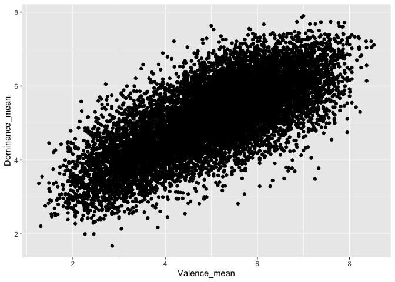
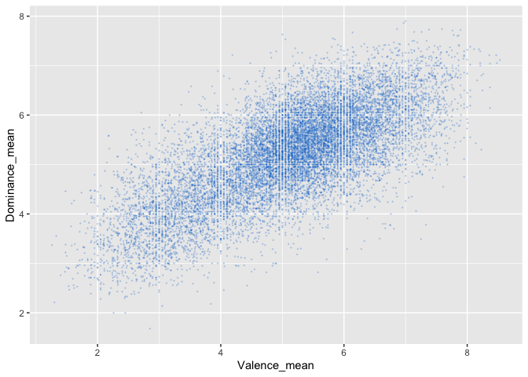
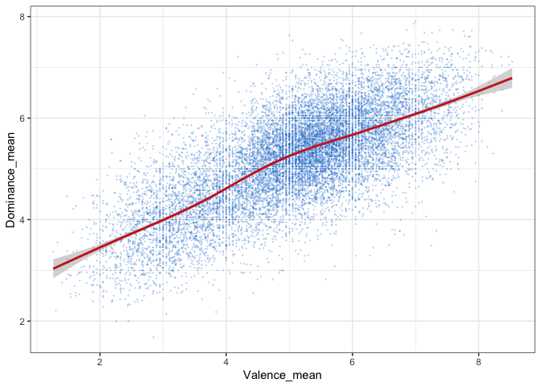
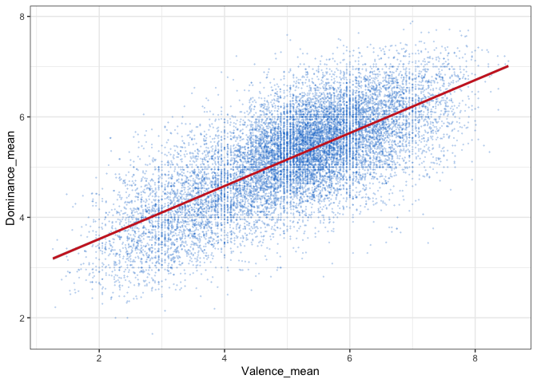
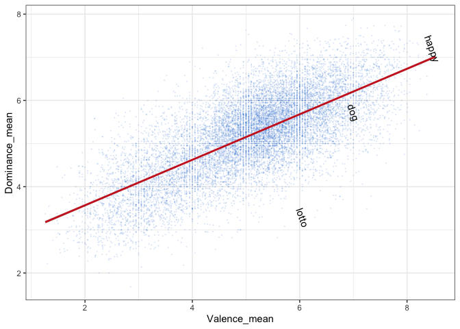

Warriner 2013
================
Steven Moran and Alena Witzlack-Makarevich
2024-07-25

``` r
library(tidyverse)
```

# Introduction

The idea here is to replicate the results of Warriner et al. (2013):

- <https://doi.org/10.3758/s13428-012-0314-x>

The abstract:

> > > Information about the affective meanings of words is used by
> > > researchers working on emotions and moods, word recognition and
> > > memory, and text-based sentiment analysis. Three components of
> > > emotions are traditionally distinguished: valence (the
> > > pleasantness of a stimulus), arousal (the intensity of emotion
> > > provoked by a stimulus), and dominance (the degree of control
> > > exerted by a stimulus).

First let’s load the data.

``` r
warriner <- read_csv("data/warriner2013.csv")
```

    ## Rows: 13915 Columns: 10
    ## ── Column specification ────────────────────────────────────────────────────────
    ## Delimiter: ","
    ## chr (1): Word
    ## dbl (9): ID, Valence_mean, Valence_SD, Arousal_mean, Arousal_SD, Dominance_m...
    ## 
    ## ℹ Use `spec()` to retrieve the full column specification for this data.
    ## ℹ Specify the column types or set `show_col_types = FALSE` to quiet this message.

# Result 1: Valence and dominance

Let’s explore the relationship between valence and dominance visually.

``` r
# the basic command looks like this: all variables you plot go into aes()
# these are you aesthetics, i.e. aspects of the data you want to see in the plot
ggplot(warriner, aes(y = Dominance_mean, x = Valence_mean)) +
  geom_point()
```

<!-- -->

Then you can work on over plotting.

``` r
# alpha stands for transparency (from 0 to 1)
ggplot(warriner, aes(y = Dominance_mean, x = Valence_mean)) +
  geom_point(alpha =0.2, size = 0.1, col = "dodgerblue3")
```

<!-- -->

Now let’s add a regression line.

``` r
# by default, geom_smooth() adds a local regression line
ggplot(warriner, aes(y = Dominance_mean, x = Valence_mean)) +
  geom_point(alpha =0.2, size = 0.1, col = "dodgerblue3") +
  geom_smooth(col = "firebrick3")+
  theme_bw()
```

    ## `geom_smooth()` using method = 'gam' and formula = 'y ~ s(x, bs = "cs")'

<!-- -->

A linear regression needs `method = "lm"`.

``` r
ggplot(warriner, aes(y = Dominance_mean, x = Valence_mean)) +
  geom_point(alpha =0.2, size = 0.1, col = "dodgerblue3") +
  geom_smooth(method = "lm", col = "firebrick3")+
  theme_bw()
```

    ## `geom_smooth()` using formula = 'y ~ x'

<!-- -->

It would be helpful to add a few words as examples.

``` r
# looking up the coordinates for individual words
ggplot(warriner, aes(x = Valence_mean, y = Dominance_mean))+
  geom_point(alpha =0.1, size = 0.07, col = "dodgerblue3") +
  geom_smooth(method = "lm", col = "firebrick3")+
  annotate(geom="text", x=8.47, y=7.21, label="happy", angle = -70)+
  annotate(geom="text", x=6.05, y=3.29, label="lotto", angle = -70) +
  annotate(geom="text", x=7, y=5.73, label="dog", angle = -70)+
  theme_bw()
```

    ## `geom_smooth()` using formula = 'y ~ x'

<!-- -->

The relationship between valence and dominance is linear: words that
make people feel happier also make them feel more in control (r =
0.717).

Calculate the slope and intercept, name your model e.g. m1.

``` r
m_Dom_Val <- lm(warriner$Dominance_mean ~ warriner$Valence_mean)
```

Have a look at the intercept and slope.

``` r
m_Dom_Val
```

    ## 
    ## Call:
    ## lm(formula = warriner$Dominance_mean ~ warriner$Valence_mean)
    ## 
    ## Coefficients:
    ##           (Intercept)  warriner$Valence_mean  
    ##                2.5140                 0.5274

Could you guess why the slope is different from what is reported in the
paper? (Hint: it’s a mistake in the paper!)

``` r
# summary() provides more details, including e.g. Adjusted R-squared:  0.5135
summary(m_Dom_Val)
```

    ## 
    ## Call:
    ## lm(formula = warriner$Dominance_mean ~ warriner$Valence_mean)
    ## 
    ## Residuals:
    ##      Min       1Q   Median       3Q      Max 
    ## -2.84779 -0.43057  0.00422  0.43876  2.48611 
    ## 
    ## Coefficients:
    ##                       Estimate Std. Error t value Pr(>|t|)    
    ## (Intercept)           2.514004   0.022724   110.6   <2e-16 ***
    ## warriner$Valence_mean 0.527419   0.004352   121.2   <2e-16 ***
    ## ---
    ## Signif. codes:  0 '***' 0.001 '**' 0.01 '*' 0.05 '.' 0.1 ' ' 1
    ## 
    ## Residual standard error: 0.6544 on 13913 degrees of freedom
    ## Multiple R-squared:  0.5136, Adjusted R-squared:  0.5135 
    ## F-statistic: 1.469e+04 on 1 and 13913 DF,  p-value: < 2.2e-16

You can calculate the correlation coefficient with `cor()`.

``` r
cor(warriner$Valence_mean, warriner$Dominance_mean)
```

    ## [1] 0.7166292

# Result 2: Valence vs. arousal

Words that are very positive or very negative are more arousing than
those that are neutral.

This is corroborated by the positive correlation between valence and
arousal.

- for positive words (mean valence rating \> 6; r = .273, p \< .001)
- and the negative correlation between valence and arousal
- for negative words (mean valence rating \< 4; r = −.293, p \< .001)

# Task 2:

- use filter() to obtain two subsets of the data:

- one data set for low valence and one for high valence following the
  specifications above

- produce two separate scatter plots

- address the overplotting issue

- calculate two separate models for the two subsets

- produce a plot with a linear regression, not too much overplotting and
  a few more words as examples

# Result 3: Valence vs. arousal

The relationship between arousal and dominance is also U-shaped as
corroborated by the positive correlation between dominance and arousal
for high-rated dominance words (mean rating \> 6; r = .139, p \< .001)
and the negative correlation between dominance and arousal for low-rated
dominance words (mean rating \< 4; r = −.193, p \< .001).

# Task 3:

- use filter() to obtain two subsets of the data:

- one data set for low valence and one for high valence following the
  specifications above

- produce two separate scatter plots

- address the overplotting issue

- calculate two separate models for the two subsets

- produce a plot with a linear regression, not too much overplotting and
  a few more words
