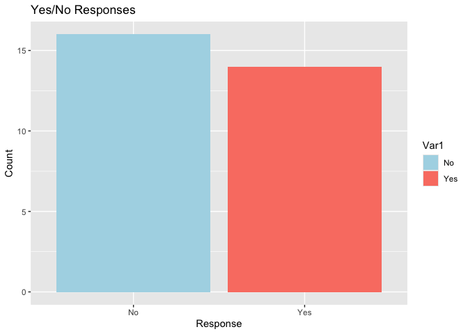
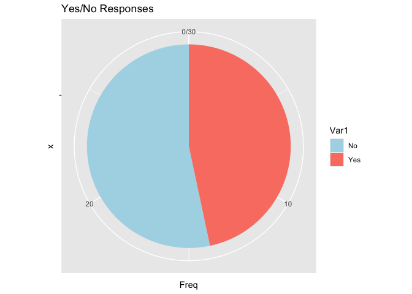

Salos 2024 summer school: What’s the background of the class?
================
Steven Moran
(22 July, 2024)

------------------------------------------------------------------------

These are the R libraries you will need:

``` r
library(tidyverse)
library(knitr)
```

Load the data.

``` r
df <- read_csv('data/Background questionnaire (Answers) - Risposte del modulo 1.csv')
```

Have a look.

``` r
df
```

    ## # A tibble: 30 × 9
    ##       ID Do you have any program…¹ If so, please rate y…² Do you have any back…³
    ##    <dbl> <chr>                                      <dbl> <chr>                 
    ##  1     1 Yes                                            1 Yes                   
    ##  2     2 Yes                                            2 Yes                   
    ##  3     3 Yes                                            4 Yes                   
    ##  4     4 Yes                                            2 Yes                   
    ##  5     5 Yes                                            2 Yes                   
    ##  6     6 Yes                                            4 Yes                   
    ##  7     7 No                                            NA Yes                   
    ##  8     8 Yes                                            1 No                    
    ##  9     9 No                                            NA Yes                   
    ## 10    10 No                                            NA No                    
    ## # ℹ 20 more rows
    ## # ℹ abbreviated names: ¹​`Do you have any programming (coding) experience?`,
    ## #   ²​`If so, please rate your programming knowledge`,
    ## #   ³​`Do you have any background in statistics?`
    ## # ℹ 5 more variables: `If so, please rate your knowledge of statistics` <dbl>,
    ## #   `Have you used R?` <chr>, `If so, please rate your R expertise` <dbl>,
    ## #   `Do you have any fieldwork experience?` <chr>, …

Have a nicer look.

``` r
kable(df)
```

| ID | Do you have any programming (coding) experience? | If so, please rate your programming knowledge | Do you have any background in statistics? | If so, please rate your knowledge of statistics | Have you used R? | If so, please rate your R expertise | Do you have any fieldwork experience? | Where and what language? |
|---:|:---|---:|:---|---:|:---|---:|:---|:---|
| 1 | Yes | 1 | Yes | 1 | Yes | 2 | No | NA |
| 2 | Yes | 2 | Yes | 2 | Yes | 3 | No | NA |
| 3 | Yes | 4 | Yes | 3 | No | NA | No | NA |
| 4 | Yes | 2 | Yes | 2 | Yes | 3 | Yes | Hungarian in Hungary |
| 5 | Yes | 2 | Yes | 2 | Yes | 1 | No | NA |
| 6 | Yes | 4 | Yes | 3 | Yes | 2 | No | NA |
| 7 | No | NA | Yes | 1 | Yes | 1 | Yes | Berlin (where I live and found the language consultants), Sundanese (Austronesian) |
| 8 | Yes | 1 | No | NA | No | NA | No | NA |
| 9 | No | NA | Yes | 1 | No | NA | No | NA |
| 10 | No | NA | No | NA | Yes | 1 | No | NA |
| 11 | No | 1 | No | 1 | No | 1 | Yes | Cameroon, Mbeuma |
| 12 | No | NA | Yes | 2 | No | NA | No | NA |
| 13 | No | 1 | Yes | 1 | No | 1 | Yes | Hulunbuir (China), North East Asia |
| 14 | Yes | 2 | Yes | 1 | No | NA | Yes | Maaloula Aramaic, in Syria. |
| 15 | No | NA | No | NA | Yes | 1 | No | NA |
| 16 | No | NA | No | NA | No | NA | No | NA |
| 17 | Yes | 1 | No | NA | Yes | 1 | Yes | Fieldwork classes with Bantu languages (Bobangi, Kikuyu), remote fieldwork on Mano, in all cases away from where the languages are normally spoken. |
| 18 | Yes | 3 | Yes | 2 | Yes | 3 | Yes | Russia for Russian dialects in Archangelsk, Macedonian dialects in Albania, Koro and Hrusso in India |
| 19 | Yes | 3 | Yes | 2 | No | 1 | No | NA |
| 20 | No | NA | Yes | 1 | No | NA | No | NA |
| 21 | Yes | 3 | Yes | 3 | Yes | 3 | No | NA |
| 22 | No | NA | No | NA | No | NA | No | NA |
| 23 | Yes | 2 | No | 1 | No | 1 | No | NA |
| 24 | Yes | 5 | Yes | 3 | Yes | 2 | No | NA |
| 25 | No | NA | Yes | 1 | Yes | 1 | No | NA |
| 26 | No | NA | Yes | 2 | Yes | 1 | Yes | Poland (Kashubian, Wymysorys), Lithuania (Lithuanian) |
| 27 | No | 1 | No | 1 | No | 1 | Yes | in Ethiopia, Oromo language |
| 28 | No | NA | No | NA | No | NA | No | NA |
| 29 | No | 1 | No | 1 | No | 1 | No | NA |
| 30 | No | NA | Yes | 2 | Yes | 1 | Yes | German-B/C/M/S |

What data types do we have? Each column represents a data type, e.g.,
numbers or categories.

``` r
str(df)
```

    ## spc_tbl_ [30 × 9] (S3: spec_tbl_df/tbl_df/tbl/data.frame)
    ##  $ ID                                              : num [1:30] 1 2 3 4 5 6 7 8 9 10 ...
    ##  $ Do you have any programming (coding) experience?: chr [1:30] "Yes" "Yes" "Yes" "Yes" ...
    ##  $ If so, please rate your programming knowledge   : num [1:30] 1 2 4 2 2 4 NA 1 NA NA ...
    ##  $ Do you have any background in statistics?       : chr [1:30] "Yes" "Yes" "Yes" "Yes" ...
    ##  $ If so, please rate your knowledge of statistics : num [1:30] 1 2 3 2 2 3 1 NA 1 NA ...
    ##  $ Have you used R?                                : chr [1:30] "Yes" "Yes" "No" "Yes" ...
    ##  $ If so, please rate your R expertise             : num [1:30] 2 3 NA 3 1 2 1 NA NA 1 ...
    ##  $ Do you have any fieldwork experience?           : chr [1:30] "No" "No" "No" "Yes" ...
    ##  $ Where and what language?                        : chr [1:30] NA NA NA "Hungarian in Hungary" ...
    ##  - attr(*, "spec")=
    ##   .. cols(
    ##   ..   ID = col_double(),
    ##   ..   `Do you have any programming (coding) experience?` = col_character(),
    ##   ..   `If so, please rate your programming knowledge` = col_double(),
    ##   ..   `Do you have any background in statistics?` = col_character(),
    ##   ..   `If so, please rate your knowledge of statistics` = col_double(),
    ##   ..   `Have you used R?` = col_character(),
    ##   ..   `If so, please rate your R expertise` = col_double(),
    ##   ..   `Do you have any fieldwork experience?` = col_character(),
    ##   ..   `Where and what language?` = col_character()
    ##   .. )
    ##  - attr(*, "problems")=<externalptr>

Do you have programming experience?

``` r
df$`Do you have any programming (coding) experience?`
```

    ##  [1] "Yes" "Yes" "Yes" "Yes" "Yes" "Yes" "No"  "Yes" "No"  "No"  "No"  "No" 
    ## [13] "No"  "Yes" "No"  "No"  "Yes" "Yes" "Yes" "No"  "Yes" "No"  "Yes" "Yes"
    ## [25] "No"  "No"  "No"  "No"  "No"  "No"

How do we tally the counts?

``` r
table(df$`Do you have any programming (coding) experience?`)
```

    ## 
    ##  No Yes 
    ##  16  14

Let’s visualize it.

``` r
# Convert the responses to a data frame
response_df <- as.data.frame(table(df$`Do you have any programming (coding) experience?`))

# Bar plot
ggplot(response_df, aes(x=Var1, y=Freq, fill=Var1)) +
  geom_bar(stat="identity") +
  labs(title="Yes/No Responses", x="Response", y="Count") +
  scale_fill_manual(values=c("lightblue", "salmon"))
```

<!-- -->

The dreaded pie chart.

``` r
ggplot(response_df, aes(x="", y=Freq, fill=Var1)) +
  geom_bar(width=1, stat="identity") +
  coord_polar(theta="y") +
  labs(title="Yes/No Responses") +
  scale_fill_manual(values=c("lightblue", "salmon"))
```

<!-- -->

If so, please rate your programming knowledge (1-5).

``` r
df$`If so, please rate your programming knowledge`
```

    ##  [1]  1  2  4  2  2  4 NA  1 NA NA  1 NA  1  2 NA NA  1  3  3 NA  3 NA  2  5 NA
    ## [26] NA  1 NA  1 NA

We can look at the distribution. (But the numbers don’t add up!)

``` r
table(df$`If so, please rate your programming knowledge`)
```

    ## 
    ## 1 2 3 4 5 
    ## 7 5 3 2 1

How many people did not respond (“NA”)?

``` r
table(df$`If so, please rate your programming knowledge`, exclude=FALSE)
```

    ## 
    ##    1    2    3    4    5 <NA> 
    ##    7    5    3    2    1   12

How about a quick summary of the numbers?

``` r
summary(df$`If so, please rate your programming knowledge`)
```

    ##    Min. 1st Qu.  Median    Mean 3rd Qu.    Max.    NA's 
    ##   1.000   1.000   2.000   2.167   3.000   5.000      12

Have you used R?

``` r
table(df$`Have you used R?`)
```

    ## 
    ##  No Yes 
    ##  15  15

Any R experts (1-5)?

``` r
table(df$`If so, please rate your R expertise`, exclude=FALSE)
```

    ## 
    ##    1    2    3 <NA> 
    ##   14    3    4    9

Let’s see if anyone reported that they don’t have coding experience, but
they have used R. Heh?

``` r
df %>% filter(`Do you have any programming (coding) experience?` == "No") %>%
  filter(`Have you used R?` == "Yes") %>%
  select(`Do you have any programming (coding) experience?`, 
              `Have you used R?`)
```

    ## # A tibble: 6 × 2
    ##   `Do you have any programming (coding) experience?` `Have you used R?`
    ##   <chr>                                              <chr>             
    ## 1 No                                                 Yes               
    ## 2 No                                                 Yes               
    ## 3 No                                                 Yes               
    ## 4 No                                                 Yes               
    ## 5 No                                                 Yes               
    ## 6 No                                                 Yes
