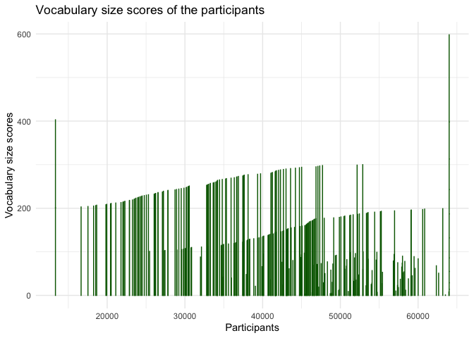
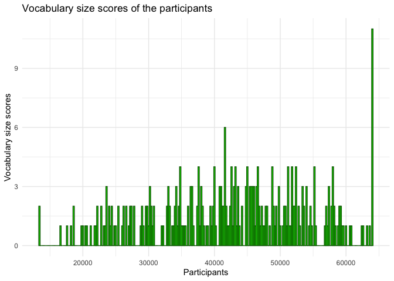

## Task 1

-   Load the data and calculate the means of two variables.

<!-- -->

    library(readxl)
    data <- read_excel("~/Library/CloudStorage/OneDrive-UniversityofHelsinki/internship_projects_summerschool/Salo Summer School/source_data/hand_on_assign/day1_0722/dataset.questionnaire.xlsx")
     
    # check the headers
    headers <- colnames(data)
    cat("These are the headers in the data frame:", headers)

    ## These are the headers in the data frame: No ID Language Gender Age L1 Reading Websites Friends Movies Music C-test Vocabulary_size

    # check out rows and columns
    rows <- nrow(data)
    cols <- ncol(data)

    cat("This data frame contains:", rows, "rows")

    ## This data frame contains: 300 rows

    cat("This data frame contains:", cols, "columns")

    ## This data frame contains: 13 columns

    # calculate the mean of the age
    cat("The mean of the age is: ", mean(data$Age))

    ## The mean of the age is:  16.71667

    # calculate the mean of vocablulary size of the participants
    cat("The mean of vocablulary size of the participants is:", mean(data$Vocabulary_size))

    ## The mean of vocablulary size of the participants is: 42366.8

## Task 2

• Plot the distribution of the Vocabulary size scores of the
participants.

• Change the color of the histogram.

• Add the title to the x-axis and the y-axis.

    # because there's only one variable, so I chose histogram
    # load the library
    library(ggplot2)
    library(dplyr)

    ## 
    ## Attaching package: 'dplyr'

    ## The following objects are masked from 'package:stats':
    ## 
    ##     filter, lag

    ## The following objects are masked from 'package:base':
    ## 
    ##     intersect, setdiff, setequal, union

    # plot the variable with its data
    ggplot(data, aes(x = Vocabulary_size, y = No)) +
      geom_bar(stat = "identity", fill = "green", color = "darkgreen") +
      labs(title = "Vocabulary size scores of the participants",
           x = "Participants",
           y = "Vocabulary size scores") +
      theme_minimal()

    # because there's only one variable, so I chose histogram
    # load the library
    library(ggplot2)
    library(dplyr)

    # plot the variable with its data
    ggplot(data, aes(x = Vocabulary_size)) +
      geom_histogram(binwidth = 200, fill = "green", color = "darkgreen") +
      labs(title = "Vocabulary size scores of the participants",
           x = "Participants",
           y = "Vocabulary size scores") +
      theme_minimal()

• Plot the relationship between the Vocabulary size and C-test scores

• Plot the distribution of the Language of the participants.
